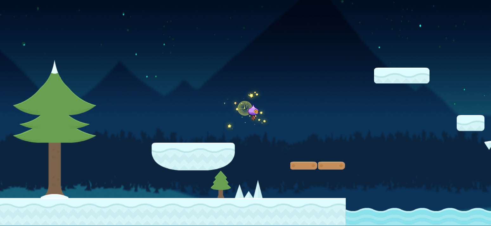
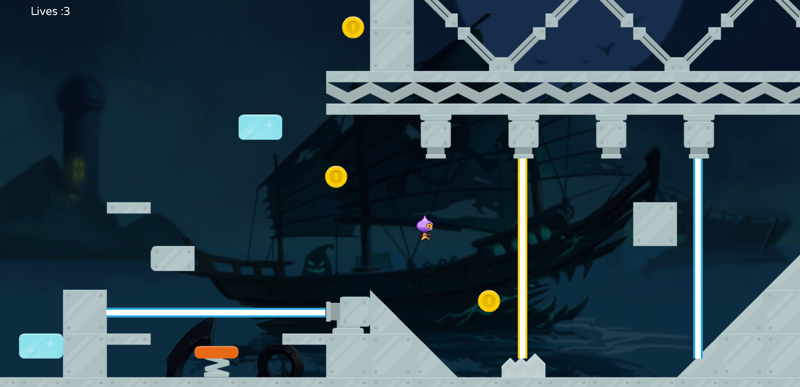

### FXGL_Mario Game
**This project is only used for learning JavaFX and fxgl technology;** 
**Pictures, sounds and other materials should not be used for other purposes;**  
>Pictures, sounds, etc. download from the Internet. If it infringes, please contact me to delete it;

This project is an extension of  [AlmasB Mario](https://github.com/AlmasB/FXGLGames/tree/master/Mario)  projects;
Two new levels have been added, and new levels may be added when there is time in the future; 
New Type: SPIKE, MOVE_PLATFORM,TEMP_PLATFORM,ICE_WATER,LASER,SPRINGBOARD;

